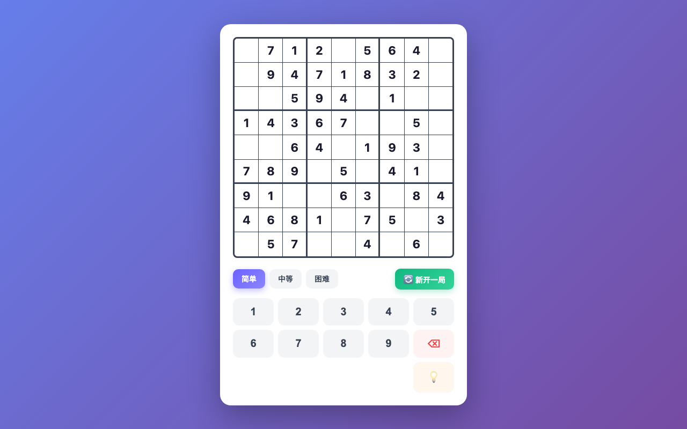

# 数独

一款简洁、交互式的浏览器 9×9 数独游戏。基于 **TypeScript** 和 **Vite** 构建，内置智能提示系统，支持三种难度，并完整适配移动端。

<p align="center">
  
  
  
</p>

## ✨ 功能特性

- **三种难度** — 简单（挖去 30–35 个数字）、中等（40–46 个）、困难（50–55 个）
- **唯一解保证** — 每道谜题均通过回溯法 + 约束传播生成，确保**有且仅有唯一解**
- **智能提示系统** — 不仅给出答案，还会解释所用解题技巧（唯一候选数、行/列/宫唯一位置）
- **多种输入方式** — 点击数字键盘、键盘输入 1–9、Backspace/Delete 删除
- **实时校验** — 输入错误即时标红
- **视觉反馈** — 选中格、同行同列同宫、相同数字高亮显示
- **移动端优先** — 针对手机和平板全面适配
- **键盘快捷键** — 完整支持桌面端键盘操作
- **清晰架构** — 游戏逻辑层（`core/`）与 UI 层（`ui/`）严格分离

## 📸 游戏截图

<p align="center">
  
  <br/>
  <sub>桌面端效果</sub>
</p>

<p align="center">
  
  <br/>
  <sub>移动端效果</sub>
</p>

## 🚀 快速开始

```bash
# 克隆仓库
git clone <仓库地址>
cd shudu

# 安装依赖
npm install

# 启动开发服务器
npm run dev
```

然后在浏览器中打开 [http://localhost:5173](http://localhost:5173)。

## 🛠️ 技术栈

| 类别 | 技术 |
|------|------|
| 语言 | TypeScript（ES2020，严格模式） |
| 构建工具 | Vite |
| 测试 | Vitest |
| 代码规范 | ESLint + @typescript-eslint |

## 📁 项目结构

```
src/
├── core/              # 纯逻辑层 — 零 DOM 依赖
│   ├── solver.ts      # 回溯法求解器（含约束传播）
│   ├── generator.ts   # 谜题生成器（保证唯一解）
│   ├── validator.ts   # 数独状态验证与候选数分析
│   ├── hint.ts        # 解题技巧识别与讲解
│   └── types.ts       # 共享类型定义
├── ui/                # UI 层 — 仅依赖 core
│   ├── board.ts       # 棋盘渲染与格子交互
│   ├── controls.ts    # 控制面板（难度、计时器、数字键盘）
│   └── theme.ts       # 样式常量
├── __tests__/         # 单元测试
│   ├── solver.test.ts
│   ├── generator.test.ts
│   ├── validator.test.ts
│   └── hint.test.ts
└── main.ts            # 应用入口
```

### 架构约束

- `core/` 模块**绝不可**导入 `ui/` 或访问 DOM API（`document`、`window` 等）
- `ui/` 模块**可以**导入 `core/`
- `__tests__/` 可以导入 `core/`

## 🎮 玩法说明

1. 在 9×9 棋盘上选择一个格子
2. 使用屏幕数字键盘或键盘输入数字（1–9）
3. 点击**橡皮擦**（🗑️）或按 **Backspace** 清除数字
4. 点击**提示**（💡）按钮，不仅会填入正确答案，还会解释所用的解题技巧
5. 点击**重新开始**重置当前谜题，或切换难度生成新谜题
6. 填满所有格子即可获胜！

## 🧪 测试

```bash
# 运行测试
npm test

# 监听模式运行测试
npm run test:watch

# 运行类型检查 + 代码规范 + 测试
npm run check
```

## 📦 构建与部署

```bash
# 生产构建
npm run build

# 本地预览生产构建
npm run preview

# 一键部署（本地预览 / GitHub Pages / ZIP 打包）
npm run deploy
```

`deploy.sh` 脚本提供三种部署方式：
1. **本地预览** — 启动本地静态服务器
2. **GitHub Pages** — 将 `dist/` 目录推送到 `gh-pages` 分支
3. **ZIP 打包** — 生成可移植的 ZIP 文件，可手动上传至 Netlify、Vercel、阿里云 OSS 等

## 🔧 可用命令

| 命令 | 说明 |
|------|------|
| `npm run dev` | 启动 Vite 开发服务器 |
| `npm run build` | 类型检查并构建生产版本 |
| `npm run preview` | 本地预览生产构建 |
| `npm test` | 运行单元测试 |
| `npm run test:watch` | 监听模式运行测试 |
| `npm run lint` | 使用 ESLint 检查代码 |
| `npm run typecheck` | 仅类型检查，不输出文件 |
| `npm run check` | 运行类型检查 + 代码规范 + 测试 |
| `npm run deploy` | 交互式部署脚本 |
| `npm run zip` | 构建并打包为 `shudu.zip` |

## 🧩 核心算法

### 求解器
基于回溯搜索，辅以约束传播（唯一候选数）加速求解。

### 生成器
1. 通过随机化回溯生成一个完整的有效数独盘面
2. 根据难度设置挖去相应数量的数字
3. 验证最终谜题**有且仅有唯一解**

### 提示引擎
分析当前盘面状态，识别选中格子适用的解题技巧：

- **唯一候选数（Naked Single）** — 该格只剩一个候选数
- **行/列/宫唯一位置（Hidden Single）** — 该数字在当前行、列或 3×3 宫中只能放在这一个格子里

## 📝 开源协议

[MIT](LICENSE)

---

<p align="center">🌐 <a href="./README.md">English README</a></p>
